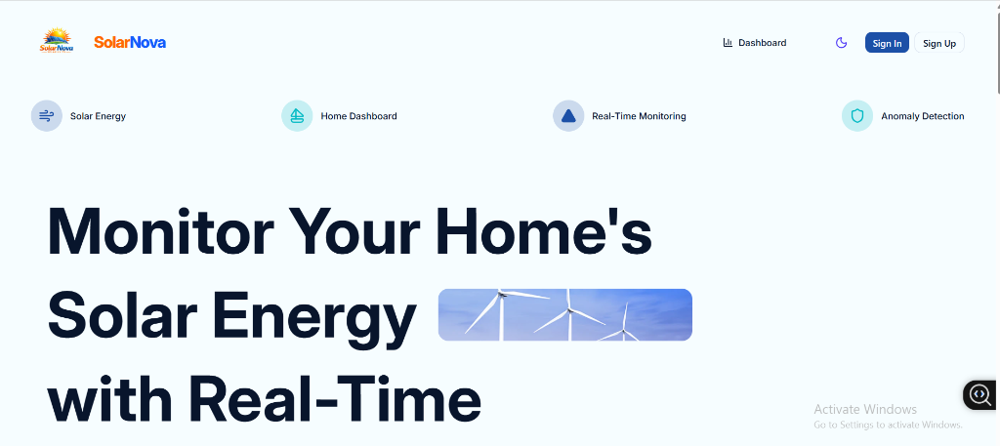
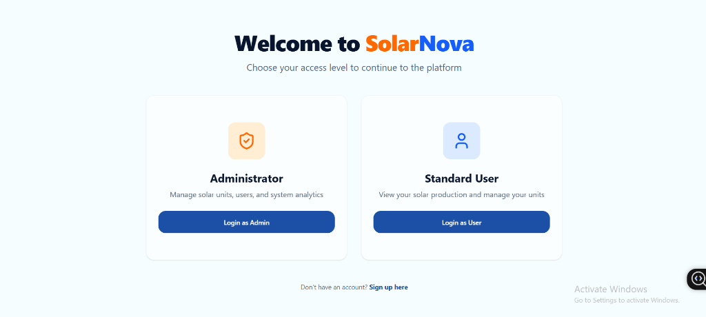
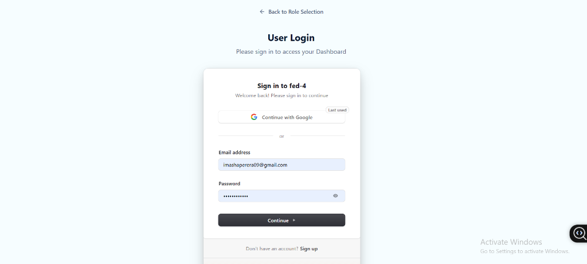
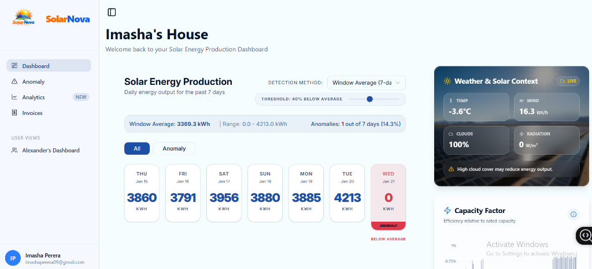
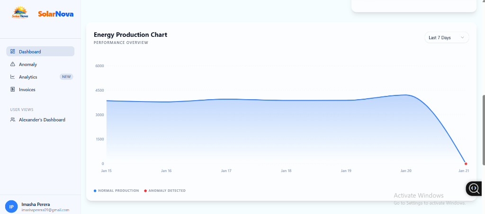
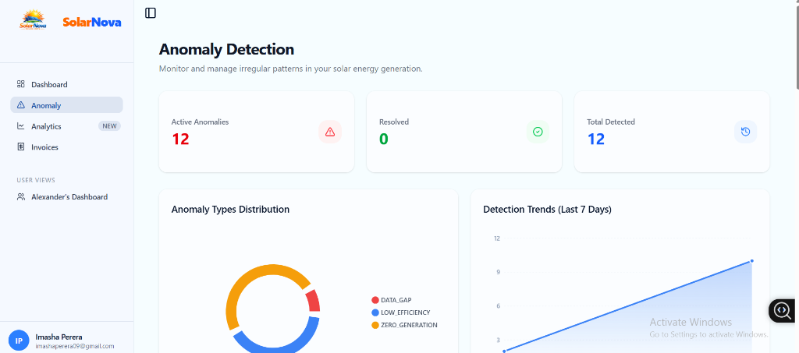
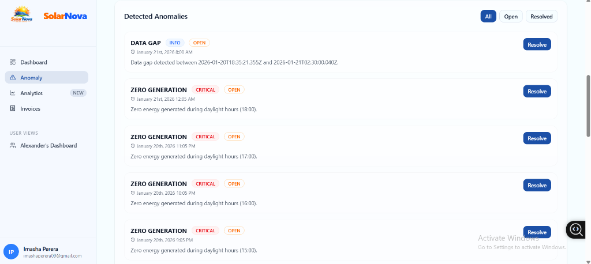
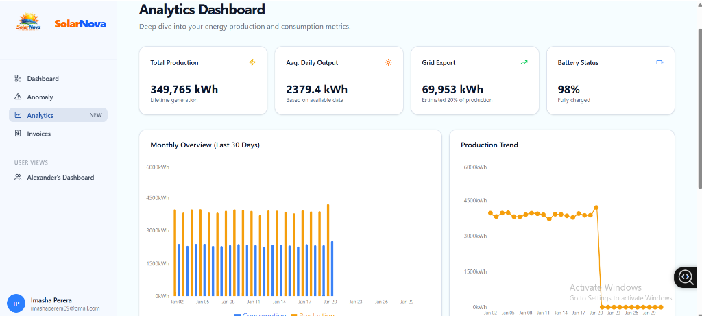
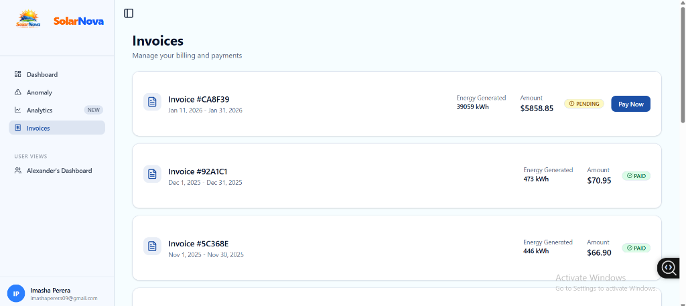

# SolarNova Frontend

## 🔗 Related Repositories

- [FED-4-BACK-END](https://github.com/Imashaperera09/FED-4-BACK-END)
- [Dataapi](https://github.com/Imashaperera09/Dataapi)
- [fed-4-front-end](https://github.com/Imashaperera09/fed-4-front-end)

SolarNova is a modern web application designed for monitoring and managing home solar energy systems. It provides real-time insights into energy production, detects anomalies, and manages billing and invoices.

## 🚀 Features

- **Real-Time Monitoring**: Track your solar energy production with dynamic charts and cards.
- **Anomaly Detection**: Automatically identify irregular patterns in energy generation.
- **Invoice Management**: View, track, and pay your solar energy bills securely.
- **User Dashboard**: Personalized view of your energy system's performance.
- **Admin Portal**: Comprehensive tools for managing solar units, users, and system settings.
- **Responsive Design**: Fully optimized for desktop and mobile devices.
## 📸 Screenshots

### 🏠 Landing Page


### 👥 Role Selection


### 🔐 Secure Login


### 📊 Energy Dashboard


### 📈 Production Analysis


### ⚠️ Anomaly Detection


### 📋 Detected Anomalies List


### 📊 Analytics Dashboard


### 💳 Invoices & Billing


## 🛠️ Tech Stack

- **Framework**: [React](https://reactjs.org/) with [Vite](https://vitejs.dev/)
- **Styling**: [Tailwind CSS](https://tailwindcss.com/)
- **State Management**: [Redux Toolkit](https://redux-toolkit.js.org/)
- **Authentication**: [Clerk](https://clerk.com/)
- **Payments**: [Stripe](https://stripe.com/)
- **Icons**: [Lucide React](https://lucide.dev/)
- **Charts**: [Recharts](https://recharts.org/)

## 📦 Getting Started

### Prerequisites

- Node.js (v18 or higher)
- npm or yarn

### Installation

1. Clone the repository:
   ```bash
   git clone <repository-url>
   ```

2. Install dependencies:
   ```bash
   npm install
   ```

3. Set up environment variables:
   Create a `.env` file in the root directory and add your Clerk and Stripe keys:
   ```env
   VITE_CLERK_PUBLISHABLE_KEY=your_clerk_pub_key
   VITE_STRIPE_PUBLISHABLE_KEY=your_stripe_pub_key
   ```

4. Start the development server:
   ```bash
   npm run dev
   ```

## 📜 Scripts

- `npm run dev`: Starts the Vite development server.
- `npm run build`: Builds the application for production.
- `npm run lint`: Runs ESLint for code quality checks.
- `npm run preview`: Previews the production build locally.


## 🤝 Contributing

Contributions are welcome!
